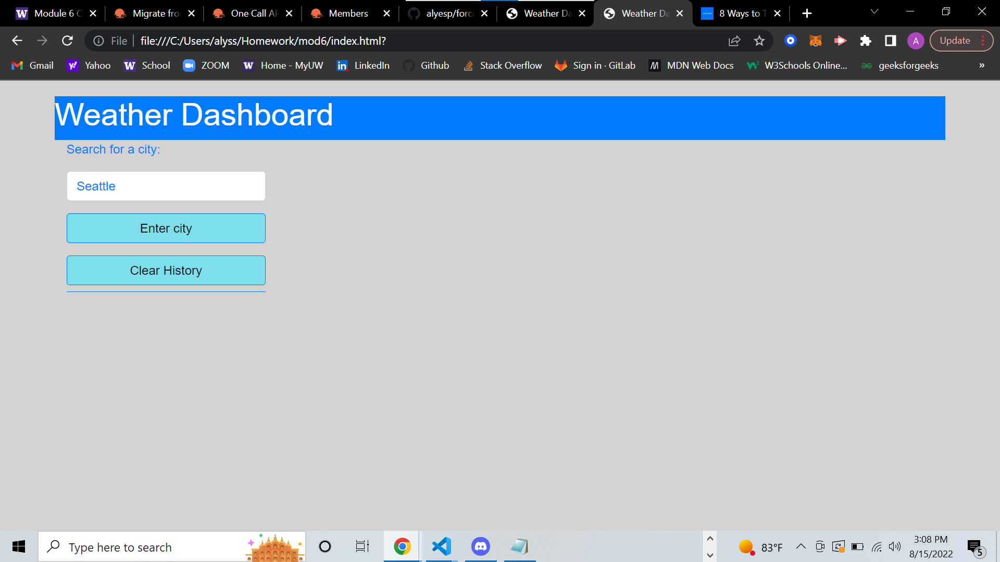

# Weather Dashboard

# Description 
A weather dashboard that allows the user to get a city's current weather conditions and the five day forecast. Third-party APIs are used to access weather data by making requests with specific parameters to a URL. 

# User Story:
<li>WHEN I search for a city
THEN I am presented with current and future conditions for that city and that city is added to the search history</li>
<li>WHEN I view current weather conditions for that city
    THEN I am presented with the city name, the date, an icon representation of weather conditions, the temperature, the humidity, the wind speed, and the UV index</li>
<li>WHEN I view the UV index
    THEN I am presented with a color that indicates whether the conditions are favorable, moderate, or severe</li>
<li>WHEN I view future weather conditions for that city
    THEN I am presented with a 5-day forecast that displays the date, an icon representation of weather conditions, the temperature, the wind speed, and the humidity</li>
<li>WHEN I click on a city in the search history
    THEN I am again presented with current and future conditions for that city</li>

# Screenshot:

# links:
#### Github link: https://github.com/alyesp/forcast-mod6
#### Deployed link: 